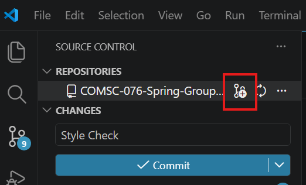

# COMSC 076 Library Project - Group 5

This is a basic library management system that allows users to:
- Add books (including title, author, ISBN, publication year, and availability status)
- Search for books by title, author, or ISBN
- Borrow books (updating availability status)
- Return books (updating availability status)
- View a list of available books
- Save and load book data from/to a file

Additionally this project considers:
- Error handling mechanisms to gracefully handle invalid user input or exceptions that may occur during file operations. 
- The efficiency of data structures and algorithms, especially for searching and sorting large numbers of books.
- The code is designed to be modular and well-organized, making it easier to maintain and extend in the future.
- The code is thoroughly documented, including Big-O analysis of the various methods in the `Library` class.

## Responsibility Distribution

- Implementation for adding and removing books from the library:
- Implementation for searching, borrowing, and returning books:
- Implementation for read/write of library contents to file:
- Implementation for parsing and serializing book data:
- Implementing testing and integration:
- Implementing graceful exception and error handling:
- Ensuring proper documentation and code comments:

## Setup & Requirements

This project follows the class style guide ([documents/Java Style Guidelines.pdf](documents/Java%20Style%20Guidelines.pdf)). I encoded the rules to [.style/java-style.xml](.style/java-style.xml) (the formatter) and [.style/checkstyle.xml](.style/checkstyle.xml) (linter rules). 

If you are using VSCode, the extensions in [.vscode/extensions.json](.vscode/extensions.json) will automatically enforce these style guides.

You also need:
- A JDK (Probably 17 or later). You should already have one installed for this class, so it shouldn't be an issue, but let me know if you have any problems.
- Git & Github account. 

## Onboarding

If you have never used Git/Github before, it can be a little confusing but this (or at least, a versioning control setup) is the best way to manage programming project collaboration and its worth learning. This [introduction](https://github.com/skills/introduction-to-github) is a pretty fast, hands on way to learn, or there are tons of other resources out there you can use. If you don't want to deal with all that, you can just follow these steps exactly for whichever environment you use:

### VSCode

1. [Install git](https://git-scm.com/install/) if you don't have it, and create a [Github Account](https://github.com/) if you don't have one.
2. Login to git in VSCode. In the bottom left there is an account button.
3. Clone the repo. Click the branching icon on the left side bar and press clone repository, or press `Ctrl+Shift+P` and type `clone`, select the `Git: Clone` option and paste the repository url: `https://github.com/Miyamiiyaa/COMSC-076-Spring-Group-Project.git`
Alternatively you can open a terminal and type this command:
    ```
    git clone https://github.com/miyamiiyaa/COMSC-076-Spring-Group-Project.git
    cd COMSC-076-Spring-Group-Project
    ```
4. Install the recommended extensions (or at least the stylechecker). If VScode does not prompt you to install them, you can search "@recommended" in the extensions panel on the left.
5. Create a `branch` for your responsibilities. The main branch is protected and requires a pull request. To create a branch, you can use `git checkout -b name-the-branch` from the terminal, or you can press this button in the source control panel:



6. When you are done writing code, commit and push your changes.
7. Submit a pull request for another group member to review your code. You can do this on github.

## Attributions

This library project was created for the final group project in COMSC 076 - Introduction to Data Structures at Evergreen Valley College.

- [Problem Solving with Algorithms and Data Structures using Java: The Interactive Edition](https://runestone.academy/ns/books/published/javads/javads.html)
- Materials provided on Canvas through the class module

Other resources referenced to implement this projected are included directly inline within javadocs comments.


### Members

- Eric Chevrie
- Evan Ha
- Jesse Hawkes
- Marlon Lopez Rivera
- Joseph Moneteon
- Aksham Tuteja

